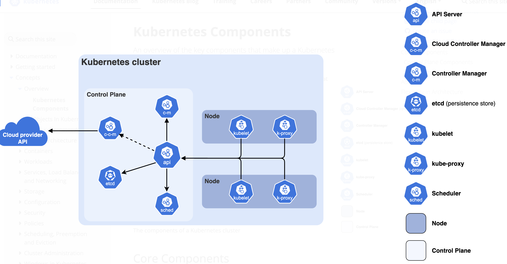

# 1. Gün: Kubernetes Mimarisi ve Bileşenleri

## Öğrenme Hedefleri
- Kubernetes'in (K8s) ne olduğunu ve neden kullanıldığını anlamak.
- Bir Kubernetes Cluster'ının anatomisini kavramak.
- **Control Plane** bileşenlerinin görevlerini öğrenmek.
- **Worker Node** bileşenlerinin nasıl çalıştığını anlamak.

---

## 1. Kubernetes Nedir?

Kubernetes (K8s), konteynerize edilmiş uygulamaların dağıtımını, ölçeklendirilmesini ve yönetimini otomatikleştiren açık kaynaklı bir konteyner orkestrasyon platformudur. Google tarafından geliştirilmiş ve Cloud Native Computing Foundation (CNCF) tarafından bağışlanmıştır.

**Neden K8s?**
- **Self-healing:** Çöken konteynerleri yeniden başlatır.
- **Auto-scaling:** Yüke göre otomatik ölçeklenir.
- **Load Balancing:** Trafiği podlar arasında dağıtır.
- **Rollout/Rollback:** Sürüm güncellemelerini ve geri alımları yönetir.

---

## 2. Kubernetes Mimarisi (Cluster Anatomisi)

Bir Kubernetes cluster'ı temel olarak iki ana bölümden oluşur:
1.  **Control Plane (Master Node):** Cluster'ın beyni. Karar mekanizması.
2.  **Worker Nodes:** İş yüklerinin (uygulamaların) çalıştığı işçiler.

---

## 3. Control Plane Bileşenleri (Cluster Beyni)

Control Plane, cluster'ın genel durumunu yönetir (örn: hangi uygulamanın kaç kopyası çalışacak). Eğer Control Plane çökerse, mevcut çalışan uygulamalarınız çalışmaya devam eder (çünkü Worker Node'lardadır), ancak cluster'ı yönetemez, yeni pod oluşturamaz veya ölçekleyemezsiniz.

### A. kube-apiserver (Merkezi Sinir Sistemi / Resepsiyon)
- **Teknik Detay:** Kubernetes Control Plane'in en kritik bileşenidir. Cluster'ın dış dünyaya açılan tek kapısıdır (HTTPS/REST).
- **Görevi:**
    - **Authentication & Authorization:** Gelen isteği kim yapıyor? Yetkisi var mı? (RBAC).
    - **Validation:** İstek geçerli mi? (Syntax kontrolü, resource kotaları).
    - **Data Persistence:** Onaylanan veriyi `etcd` veritabanına yazar.
    - **Watch Mechanism:** Diğer bileşenler (Scheduler, Kubelet vs.) API Server'ı sürekli dinler (watch). API Server sadece pasif bir veritabanı değildir, değişiklikleri ilgili birimlere haber verir.
- **Ölçeklenebilirlik:** Stateless (durumsuz) bir yapıda olduğu için, trafik arttığında birden fazla API Server instance'ı (Load Balancer arkasında) çalıştırılarak yatayda ölçeklenebilir.
- **Metafor:** Büyük bir şirketin **CEO Asistanı** veya bir havalimanının **Kule Operatörü**. Pilotlar (Kubelet) veya yer hizmetleri (Controller), kule (API Server) onayı olmadan pistte hareket edemez. Her şey onun üzerinden akar.

### B. etcd (Cluster Hafızası / Kara Kutu)
- **Teknik Detay:** Tüm cluster verilerinin (Pod bilgileri, Node durumu, Secretlar, ConfigMapler) tutulduğu, tutarlı (consistent) ve yüksek erişilebilir (HA) bir key-value (anahtar-değer) veritabanıdır. RAFT konsensüs algoritmasını kullanır.
- **Görevi:** Cluster'ın "Single Source of Truth"udur (Tek Gerçeklik Kaynağı).
- **Kritiklik:** Eğer `etcd` verisini kaybederseniz, cluster'ınızı kaybedersiniz. Bu yüzden düzenli yedek alınması hayati önem taşır.
- **Metafor:** İnsanın **Uzun Süreli Hafızası** veya uçağın **Kara Kutusu**. Geçmişte ne oldu, şu an ne olması gerekiyor, tüm devlet sırları burada saklıdır. Beyin (API Server) kararları buradaki bilgiye göre verir.

### C. kube-scheduler (Planlayıcı / İnsan Kaynakları)
- **Teknik Detay:** Yeni oluşturulan (`Pending` statüsündeki) ve henüz bir Node'a atanmamış Pod'ları sürekli izler.
- **Görevi:** Pod'u alıp "Hangi Node bu iş için en uygun?" sorusunu cevaplar. Node'a atama yapmaz, sadece "Bu Pod şu Node'a gitmeli" kararını verir ve API Server'a bildirir.
- **Nasıl Çalışır?** İki aşamalı bir süreç izler:
    1.  **Filtering (Eleme):** Kaynak yetiyor mu? (CPU/RAM), Taint/Toleration engeli var mı? Node sağlıklı mı?
    2.  **Scoring (Puanlama):** Kalan adaylar arasında en iyisi hangisi? (Örn: İmaj zaten o node'da var mı? Yük dağılımı dengeli mi?)
- **Metafor:** Bir şirketin **İşe Alım Müdürü (İK)**. Yeni bir çalışan (Pod) geldiğinde, onun yeteneklerine ve şirketin boş masalarına (Node kapasitesi) bakar. Sigara içmeyen (Taint), sessiz ortam isteyen (Affinity) çalışanı en uygun departmana yerleştirir.

### D. kube-controller-manager (Otomatik Pilot / Termostat)
- **Teknik Detay:** Mantıksal kontrol döngülerini (control loops) çalıştıran tek bir binary süreçtir.
- **Temel Felsefe:** Mevcut Durum (Current State) ile Arzu Edilen Durum (Desired State) arasındaki farkı (gap) kapatmak.
- **Alt Bileşenler:**
    - *Node Controller:* Bir Node'dan sinyal (heartbeat) kesilirse ne yapılacağına karar verir.
    - *Replication Controller:* Pod sayısı 3 olması gerekiyorken 2'ye düştüyse, 1 tane daha oluştur emrini verir.
    - *Endpoint Controller:* Service ve Pod'ları birbirine bağlar.
- **Metafor:** Evdeki **Klima (Termostat)**. Siz sıcaklığı 24 dereceye (Desired State) ayarladınız. Oda sıcaklığı 20 derece (Current State). Klima aradaki farkı görür ve ısıtmaya başlar. Oda 26 olursa soğutur. Sürekli bir denetim halindedir.

---

## 4. Worker Node Bileşenleri (Fabrika İşçileri)

Uygulamaların (iş yüklerinin) fiilen çalıştığı, CPU ve RAM tükettiği sunuculardır.

### A. kubelet (Node Kaptanı / Ustabaşı)
- **Teknik Detay:** Cluster'daki her Node üzerinde çalışan bir ajandır. Node'un ana yöneticisidir.
- **Görevi:**
    - API Server'ı dinler: "Bana yeni iş var mı?"
    - PodSpecs (Pod tariflerini) alır ve Container Runtime'a (containerd) iletir.
    - Konteynerlerin sağlıklı çalışıp çalışmadığını (Liveness/Readiness Probes) kontrol eder.
    - Node'un kaynak durumunu (CPU/RAM kullanımı) düzenli olarak API Server'a raporlar.
- **Kritik:** Eğer Kubelet durursa, Node "NotReady" durumuna düşer ve üzerindeki podlar yönetilemez hale gelir.
- **Metafor:** Geminin **Kaptanı** veya inşaattaki **Ustabaşı**. Merkezden (API Server) gelen projeyi alır, işçilere (Container Runtime) "Şurayı kazın, burayı örün" der. İşçilerin kaytarmadığını (Health check) kontrol eder ve merkeze rapor verir.

### B. kube-proxy (Ağ Trafik Polisi / Switch)
- **Teknik Detay:** Her Node'da çalışan bir ağ proxy'sidir. Service CIDR bloklarının yönetiminden sorumludur.
- **Görevi:** Kubernetes Service kavramının (sanal IP) teknik uygulayıcısıdır. Pod'ların IP'leri değişse bile Service IP'sinin sabit kalmasını ve trafiğin doğru Pod'a gitmesini sağlar.
- **Nasıl Çalışır?** Genellikle işletim sisteminin paket filtreleme katmanını (iptables veya IPVS) manipüle ederek kurallar yazar.
- **Metafor:** Şehrin **Trafik Polisi** veya **Yön Tabelaları**. "Lezzet Restoranı'na nasıl giderim?" (Service erişimi) sorusuna, "Şu sokaktan dön, 3. kapı" (Pod IP'si) cevabını verir. Restoran taşınsa bile (Pod ölse ve yeni IP alsa), tabela (kube-proxy kuralı) hemen güncellenir.

### C. Container Runtime (Motor / İşçi)
- **Teknik Detay:** Kubernetes'in konteynerleri (Docker Image'larını) çalıştırmak için kullandığı düşük seviyeli yazılımdır. CRI (Container Runtime Interface) standardına uyan herhangi bir yazılım olabilir.
- **Örnekler:**
    - **containerd:** (Endüstri standardı, Docker'ın içinden ayrıştırılmış hafif motor).
    - **CRI-O:** (Sadece Kubernetes için geliştirilmiş, hafif runtime).
    - **Docker Engine:** (Eskiden kullanılırdı, artık araya `dockershim` katmanı gerektirdiği için Kubernetes v1.24+ ile doğrudan desteği kalktı).
- **Görevi:** İmajı Registry'den çeker (pull), konteyneri başlatır, durdurur ve izole eder (Namespace/Cgroups).
- **Metafor:** Arabanın **Motoru**. Şoför (Kubelet) gaza basar, ama tekerlekleri döndüren güç (işi yapan) motordur.

---

## Özet Tablo

| Bileşen | Konum | Rol | Basit Tanım |
| :--- | :--- | :--- | :--- |
| **API Server** | Control Plane | Haberleşme | Cluster'ın giriş kapısı |
| **etcd** | Control Plane | Depolama | Cluster'ın hafızası/veritabanı |
| **Scheduler** | Control Plane | Planlama | Pod'u hangi Node'a koyacağına karar veren |
| **Controller Mgr** | Control Plane | Denetleme | İstenen durum = Mevcut durum kontrolü |
| **Kubelet** | Worker Node | Uygulama | Node'un kaptanı, emri uygular |
| **Kube-proxy** | Worker Node | Network | Ağ trafiğini yönetir |
| **Container Runtime** | Worker Node | Çalıştırma | Konteyneri çalıştıran motor |

